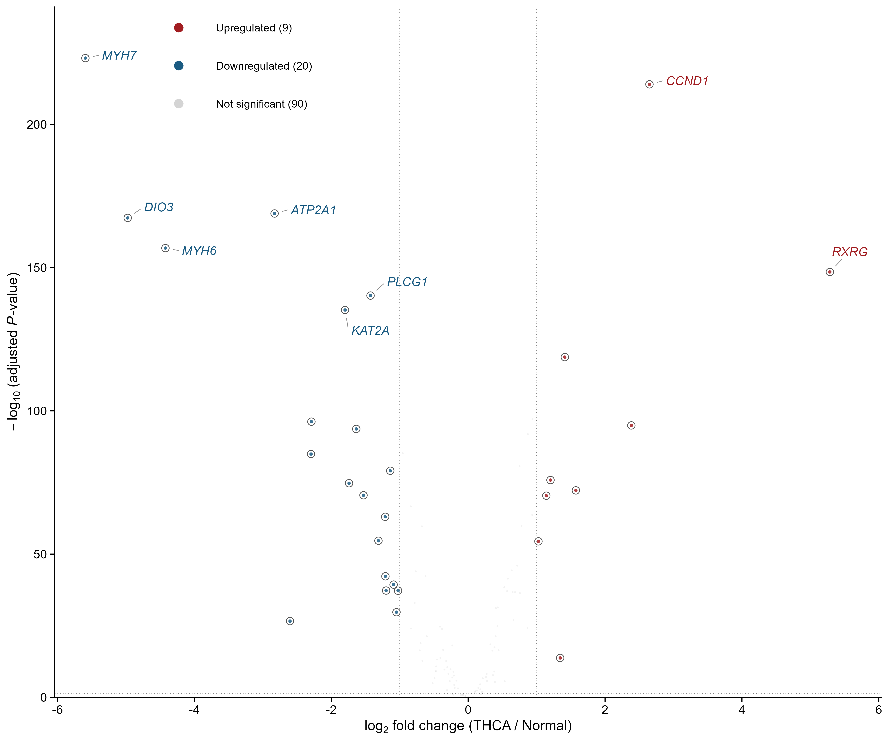
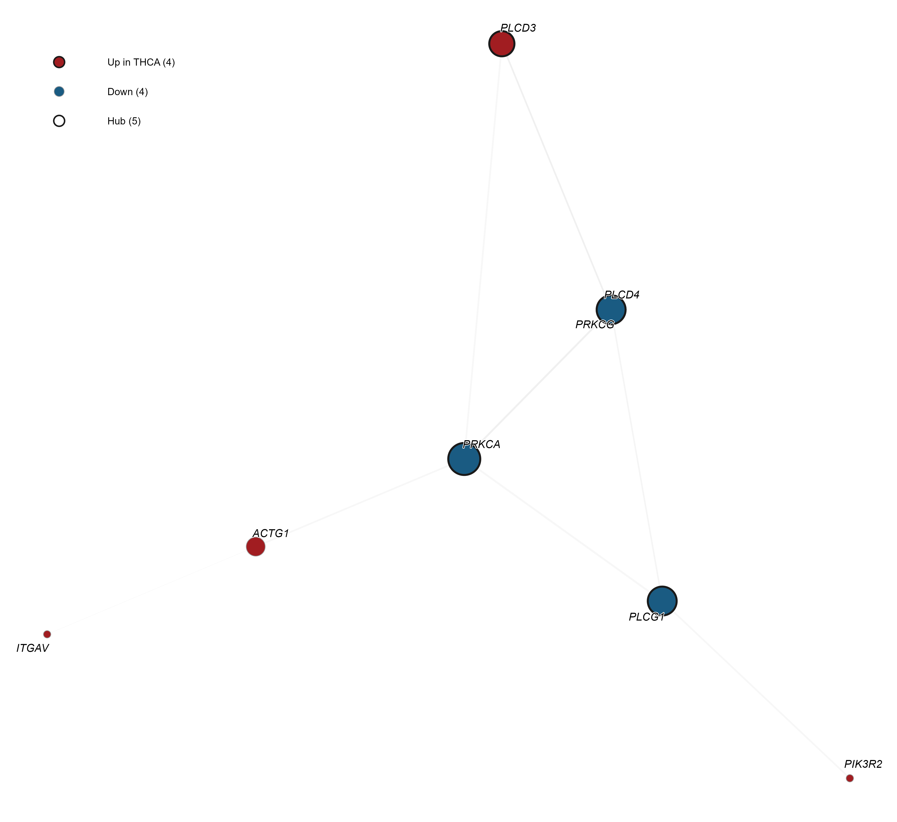

# thyroid-volcano-ppi

**Análise de Expressão Diferencial e Rede de Interação Proteína-Proteína no Carcinoma de Tireoide (THCA)**

[](https://www.r-project.org/)
[](https://opensource.org/licenses/MIT)
[](renv.lock)
[](Dockerfile)

---

> **Este README foi escrito para profissionais da saúde.**
> Se você nunca usou R ou GitHub na vida, não se preocupe: cada passo está explicado abaixo.
> As seções mais técnicas estão no final do documento (em inglês).

---

## O que este projeto faz? (em linguagem simples)

Este projeto compara **quais genes estão com a atividade alterada** em tumores de tireoide (carcinoma papilífero, THCA) em relação ao tecido normal da tireoide.

Usamos dados públicos do **TCGA** (The Cancer Genome Atlas) e do **GTEx** (Genotype-Tissue Expression), totalizando **783 amostras**: 504 de tumor e 279 de tecido normal.

O foco é na **via de sinalização do hormônio tireoidiano** (KEGG hsa04919), com 121 genes analisados.

### Os dois resultados principais são:

| Figura | O que mostra |
|--------|-------------|
| **Figura 1: Volcano Plot** | Quais genes estão **superexpressos** (mais ativos) ou **subexpressos** (menos ativos) no tumor, e com que nível de significância estatística |
| **Figura 2: Rede PPI** | Como as **proteínas** desses genes interagem entre si, formando uma rede de contatos, e quais proteínas são os "hubs" (pontos centrais da rede) |

---

## O que você precisa ter instalado?

### 1. Instale o R

O R é um programa gratuito de análise estatística.

- Acesse: **https://cran.r-project.org/**
- Clique em **"Download R for Windows"** (ou macOS, conforme seu sistema)
- Clique em **"base"** e depois em **"Download R-X.X.X for Windows"**
- Execute o instalador e siga os passos: **Avançar → Avançar → Concluir**

> **O que e o R?** E como se fosse um "Excel turbinado" para analises cientificas. Voce nao precisa saber programar: basta seguir os passos abaixo.

### 2. Instale o RStudio (opcional, mas recomendado)

O RStudio é uma interface mais amigável para usar o R.

- Acesse: **https://posit.co/download/rstudio-desktop/**
- Baixe a versão gratuita (RStudio Desktop, Open Source Edition)
- Instale normalmente

---

## Passo a passo para rodar o script

### Antes de começar: baixe o repositorio

Você pode baixar o projeto inteiro de duas formas:

**Opcao A: Se voce NAO tem Git instalado (a mais facil):**
1. No topo desta página do GitHub, clique no botão verde **"<> Code"**
2. Clique em **"Download ZIP"**
3. Extraia o arquivo `.zip` para uma pasta no seu computador (ex: `C:\Users\SeuNome\Downloads\thyroid-volcano-ppi`)
4. Essa pasta extraída será seu **diretório de trabalho**

**Opcao B: Se voce tem Git instalado:**
```bash
git clone https://github.com/santosry/thyroid-volcano-ppi.git
```

---

### PASSO 1: Baixe o arquivo de dados (OBRIGATORIO)

O script **não funciona** sem o arquivo de expressão gênica. Você tem duas opções:

#### Opcao 1: Download automatico (recomendado):
1. Abra o RStudio
2. No menu superior, clique em **File → Open File**
3. Navegue até a pasta do projeto e abra o arquivo `run_pipeline.R`
4. No console do R (painel inferior), digite:
```r
source("scripts/download_data.R")
```
5. O download será feito automaticamente (~5 MB). Aguarde a mensagem de confirmação.

#### Opcao 2: Download manual:
1. Acesse este link: **https://xenabrowser.net/?bookmark=c486b845ee2e750c3a9d2fc5145c8426**
2. No canto superior direito, clique no botão **"Download"**
3. Selecione **"Download current visualization data"**
4. Salve o arquivo exatamente como: **`XENA_THCA.tsv`**
5. Mova o arquivo para a pasta: `data/raw/` (dentro da pasta do projeto)

> **Importante:** O arquivo DEVE estar em: `thyroid-volcano-ppi/data/raw/XENA_THCA.tsv`

---

### PASSO 2: Instale os pacotes necessarios

Na primeira vez que rodar, o script instala tudo automaticamente. Mas se quiser instalar antes:

1. Abra o RStudio
2. No console do R (painel inferior), copie e cole o seguinte comando:
```r
install.packages("renv")
renv::restore()
```
3. Aguarde a instalação terminar (pode levar de 5 a 15 minutos, dependendo da sua internet)
4. Varios pacotes serao instalados: e normal aparecerem muitas mensagens

> **O que esta acontecendo?** O comando `renv::restore()` esta instalando exatamente as mesmas versoes de pacotes que os autores usaram. Isso garante que o resultado seja reproduzivel.

---

### PASSO 3: Execute o script

1. No RStudio, abra o arquivo `run_pipeline.R`
2. Clique no botão **"Source"** (canto superior direito do editor de script)
   - Ou digite no console:
```r
source("run_pipeline.R")
```
3. Aguarde de **3 a 5 minutos** (o script precisa de internet para acessar os bancos de dados STRING e KEGG)
4. Se tudo der certo, você verá a mensagem: **"PIPELINE COMPLETED SUCCESSFULLY"**

---

### PASSO 4: Veja os resultados

Todos os resultados estarão na pasta `results/`:

- **Figuras:** `results/figures/`
  - `Fig1_Volcano_THCA_vs_Normal.png`: Volcano Plot
  - `Fig2_PPI_Network_THCA_DEGs.png`: Rede de interacao proteina-proteina
- **Tabelas:** `results/tables/`
- **Metadados da rede:** `results/network/`

---

## Como interpretar os resultados

### Figura 1: Volcano Plot



O Volcano Plot é o gráfico mais comum em estudos de expressão gênica. Veja como lê-lo:

| Elemento | O que significa |
|----------|----------------|
| **Eixo X** | `log2(fold change)`: direcao e intensidade da mudanca. Valores **positivos** = gene mais expresso no tumor. Valores **negativos** = gene menos expresso no tumor |
| **Eixo Y** | `-log10(valor-p ajustado)`: significancia estatistica. Quanto **mais alto** o ponto, **mais confiavel** e a diferenca |
| **Pontos azuis** | Genes **superexpressos** no tumor (9 genes). A atividade desses genes esta aumentada no cancer |
| **Pontos magenta** | Genes **subexpressos** no tumor (20 genes). A atividade desses genes esta diminuida no cancer |
| **Pontos cinza** | Genes sem diferenca significativa (90 genes) |
| **Linhas tracejadas** | Limiares estatísticos: linha vertical = 2× de mudança; linha horizontal = 5% de taxa de falsa descoberta (FDR) |
| **Circulos abertos** | Genes que pertencem a via KEGG do hormonio tireoidiano (hsa04919) |
| **Nomes nos pontos** | Genes mais relevantes identificados com `ggrepel` |

**Resumo para interpretação biológica:**
- Genes no canto **superior direito** = mais ativos no tumor, com alta confiança estatística
- Genes no canto **superior esquerdo** = menos ativos no tumor, com alta confiança estatística
- No total, **29 genes** mostraram diferença significativa (9 ↑, 20 ↓)

---

### Figura 2: Rede de Interacao Proteina-Proteina (PPI)



A rede PPI mostra como as proteínas dos genes alterados interagem fisicamente umas com as outras.

| Elemento | O que significa |
|----------|----------------|
| **Cada círculo (nó)** | Uma proteína codificada por um gene diferencialmente expresso |
| **Cores dos nos** | Cada cor representa um **modulo funcional**: proteinas que trabalham juntas na mesma funcao biologica (detectado pelo algoritmo walktrap) |
| **Tamanho do no** | Proporcional ao **grau de conectividade** (degree): quantas outras proteinas ela interage. Quanto maior, mais conectada |
| **Borda grossa escura** | **Proteina Hub**: proteina central da rede, com muitas conexoes. Sao 5 hubs identificados |
| **Linhas entre nós (arestas)** | Interação física entre duas proteínas, conforme o banco STRING v12.0. Linha mais grossa = interação mais confiável (escore ≥ 700) |
| **Linhas cinza** | Interações dentro do mesmo módulo funcional |
| **Linhas rosa claro** | Interações entre módulos diferentes (apenas 1 neste caso) |
| **Nomes nos nós** | Proteínas hub + genes da via KEGG do hormônio tireoidiano |

**Resumo para interpretação biológica:**
- Os **hubs** sao os genes mais importantes da rede: se voce interferir neles, afeta toda a rede
- Os **módulos** sugerem funções biológicas específicas alteradas no tumor
- Uma rede com poucas conexões entre módulos (como neste caso: só 1) sugere que cada módulo atua de forma relativamente independente

---

## Arquivos gerados e o que cada um significa

### Tabelas principais (`results/tables/`)

| Arquivo | O que contém |
|---------|-------------|
| `T01_sample_composition.tsv` | Quantas amostras de cada tipo (Normal vs THCA) foram analisadas |
| `T02_deg_summary.tsv` | Resumo dos parametros da analise: quantos genes testados, quantos DEGs, thresholds usados |
| `T03_deg_full_results.tsv` | Resultado completo: todos os 119 genes com log2FC, valor-p, valor-p ajustado, classificacao (Up/Down/NS) |
| `T04_top20_degs.tsv` | Os 20 genes com maior diferenca de expressao |
| `T05_kegg_missing_genes.tsv` | Genes da via KEGG que nao foram detectados nos dados |
| `T06_hub_proteins.tsv` | Proteinas hub da rede PPI com metricas de centralidade |
| `T07_kegg_degs_ppi.tsv` | Tabela integrada: genes KEGG que sao DEGs + suas metricas na rede PPI |

### Metadados da rede (`results/network/`)

| Arquivo | O que contém |
|---------|-------------|
| `N01_string_mapping.tsv` | Mapeamento: gene → ID da proteína no STRING |
| `N02_string_interactions.tsv` | Lista de interações proteína-proteína usadas na rede |
| `N03_centrality_metrics.tsv` | Métricas completas de centralidade para cada proteína da rede |
| `N04_network_summary.tsv` | Estatísticas globais da rede |

---

## Perguntas frequentes (FAQ)

### "Apareceu um erro dizendo que o arquivo XENA_THCA.tsv não foi encontrado"

**Solução:** Volte ao **PASSO 1** acima e baixe o arquivo de dados. O arquivo **precisa** estar em `data/raw/XENA_THCA.tsv`.

### "O download automático falhou"

**Solução:** Use o download manual (Opção 2 do PASSO 1). Às vezes o Xena Browser bloqueia downloads automatizados.

### "Deu erro de conexão com a internet durante a análise"

**Solução:** O script precisa de internet para acessar STRING e KEGG. Verifique sua conexão e tente novamente.

### "Quanto tempo demora para rodar?"

Cerca de **3 a 5 minutos** com uma boa conexão de internet. Na primeira execução, a instalação de pacotes pode levar mais 10-15 minutos.

### "O que é 'log₂ fold change'?"

É uma medida de quanto a expressão de um gene muda. Um log₂FC de **+1** significa que o gene está **2× mais expresso** no tumor. Um log₂FC de **+2** = 4× mais expresso. Um log₂FC de **-1** = 2× menos expresso.

### "O que é 'FDR' ou 'valor-p ajustado'?"

O valor-p mede a probabilidade de a diferença observada ser obra do acaso. Como testamos muitos genes ao mesmo tempo, o valor-p precisa ser "ajustado" (correção de Benjamini-Hochberg). **FDR < 0,05** significa que aceitamos no máximo 5% de falsos positivos entre todos os genes identificados como alterados.

### "Não sei usar o R. Tem outro jeito?"

Nao se preocupe: voce so precisa copiar e colar os comandos. Se instalou o RStudio, e ainda mais facil: abra o script e clique em "Source". O R fara todo o trabalho.

### "Quero mudar os parâmetros da análise (ex: thresholds)"

Abra o arquivo `R/00_setup.R` e altere os valores dentro da lista `THRESHOLD`:
```r
THRESHOLD <- list(
  lfc        = 1.0,     # Aumente para ser mais restritivo na diferença
  fdr        = 0.05,    # Diminua para ser mais rigoroso (ex: 0.01)
  string     = 700      # Diminua para incluir interações menos confiáveis (ex: 400)
)
```
Depois é só rodar o script novamente.

---

## Autores

| Autor | ORCID | Afiliação |
|--------|-------|-----------|
| **Leticia Maria Dias Freitas** (autora correspondente) | [0009-0009-9930-9588](https://orcid.org/0009-0009-9930-9588) | Escola Técnica Estadual João Barcelos Martins (FAETEC), Campos dos Goytacazes, RJ |
| Ryan de Paulo Santos | [0009-0005-6770-2001](https://orcid.org/0009-0005-6770-2001) | Instituto Federal de Educacao, Ciencia e Tecnologia Fluminense (IFFluminense), Campus Campos Guarus, Campos dos Goytacazes, RJ |
| Thaís Faria Coutinho da Silva Pereira | [0009-0005-7091-2480](https://orcid.org/0009-0005-7091-2480) | Escola Técnica Estadual João Barcelos Martins (FAETEC), Campos dos Goytacazes, RJ |

**Autora correspondente:** Leticia Maria Dias Freitas: [leticiamariadiasfreitas@gmail.com](mailto:leticiamariadiasfreitas@gmail.com)

---

## Contribuicoes dos Autores: CRediT Taxonomy

| Autor | Contribuição |
|--------|-------------|
| **Leticia Maria Dias Freitas** | Conceituacao (Lideranca); Metodologia (Igual); Software (Igual); Analise Formal (Igual); Curadoria de Dados (Igual); Validacao (Igual); Visualizacao (Igual); Investigacao (Igual); Escrita: Rascunho Original (Lideranca); Administracao do Projeto (Suporte) |
| **Ryan de Paulo Santos** | Conceituacao (Suporte); Metodologia (Igual); Software (Igual); Analise Formal (Igual); Curadoria de Dados (Igual); Validacao (Igual); Visualizacao (Igual); Investigacao (Igual); Escrita: Rascunho Original (Igual); Administracao do Projeto (Lideranca); Escrita: Revisao e Edicao (Suporte) |
| **Thais Faria Coutinho da Silva Pereira** | Supervisao (Lideranca); Revisao Cientifica (Lideranca); Validacao (Suporte) |

---

## Estrutura do repositorio

```
thyroid-volcano-ppi/
├── README.md
├── run_pipeline.R              Script principal (e so rodar este!)
├── R/                          Modulos do pipeline
│   ├── 00_setup.R              Parâmetros e pacotes
│   ├── 01_functions.R          Funções auxiliares
│   ├── 02_import.R             Importação dos dados
│   ├── 03_deg.R                Expressão diferencial (limma)
│   ├── 04_volcano.R            Figura 1: Volcano Plot
│   ├── 05_ppi.R                Figura 2: Rede PPI
│   └── 06_supplementary.R      Tabelas suplementares
├── data/
│   ├── raw/                    Coloque XENA_THCA.tsv aqui
│   ├── processed/              Dados intermediários
│   └── string_cache/           Cache do STRING
├── scripts/
│   ├── download_data.R         Download automático dos dados
│   └── setup_renv.R            Inicialização do renv
├── results/
│   ├── figures/                PNGs em 600 dpi
│   ├── tables/                 Tabelas TSV (7 principais + 4 suplementares)
│   └── network/                Metadados da rede PPI
├── docs/                       Documentação suplementar
├── logs/                       Logs de execução
├── tests/                      Testes automatizados
├── Dockerfile                  Container Docker
├── renv.lock                   Versões exatas dos pacotes R
├── LICENSE                     MIT
└── CITATION.cff                Metadados de citação
```

---

## Parametros da analise

| Parâmetro | Valor | O que significa |
|-----------|-------|-----------------|
| \|log₂FC\| mínimo | 1.0 | Mudança de pelo menos 2× na expressão |
| FDR máximo | 0.05 | Máximo de 5% de falsos positivos |
| Filtro de expressão | >0.5 em ≥10% | Genes precisam ter sinal detectável |
| Escore STRING mínimo | 700 | Alta confiança na interação proteica (top 25%) |
| Via KEGG | hsa04919 | Sinalização do hormônio tireoidiano |
| Versão STRING | 12.0 | Versão mais recente do banco |
| Seed | 42 | Garante que os resultados sejam sempre os mesmos |

---

## Parametros das figuras

Ambas as figuras seguem o padrão editorial da **Nature Communications / Cell Press**:

| Propriedade | Especificação |
|-------------|---------------|
| Formato | PNG 600 dpi |
| Volcano Plot | 180 × 150 mm |
| Rede PPI | 180 × 180 mm |
| Tipografia | Sans-serif (Arial/Helvetica), 14pt |
| Fundo | Branco, eixos abertos |
| Cores | Azul `#4477AA` (Superexpresso), Magenta `#AA4488` (Subexpresso) |
| Rótulos | `ggrepel` com linhas guia |
| Rede PPI | Layout Fruchterman-Reingold, comunidades walktrap |

---

## Reprodutibilidade

- `set.seed(42)`: a semente fixa garante resultados identicos
- Todos os parametros em `R/00_setup.R`
- Caminhos via `here::here()`: sem caminhos absolutos
- `sessionInfo()` salvo em `logs/`
- `renv.lock`: versoes exatas de todos os pacotes
- `Dockerfile`: ambiente Linux completo e reproduzivel
- `CITATION.cff`: metadados de citacao padronizados
- `results/CHECKSUMS.md`: hashes MD5 para verificacao de integridade

---

## Testes

```r
# Executar todos os testes
testthat::test_dir("tests/testthat")
```

Os testes cobrem: validação da escala de expressão, extração de genes KEGG, construção do grafo, métricas de centralidade e exportação TSV.

---

## Declaracao de Uso de Inteligencia Artificial

Em conformidade com a **Portaria CNPq nº 2.664/2026**, que dispõe sobre o uso de inteligência artificial em pesquisas científicas, declaramos que as seguintes ferramentas de IA foram utilizadas como suporte técnico e metodológico neste projeto:

| Ferramenta de IA | Desenvolvedor | Tarefas realizadas |
|------------------|---------------|--------------------|
| **DeepSeek-v4-pro** | DeepSeek | Otimização de código R, auditoria de namespaces, revisão de funções estatísticas |
| **Codex** | OpenAI | Geração e depuração de scripts R, suporte à documentação técnica |
| **ChatGPT 5.5** | OpenAI | Revisão textual, estruturação de documentação, sugestões de reprodutibilidade |
| **Grok** | xAI | Análise exploratória, prototipagem de visualizações, suporte metodológico |

**Em todos os casos**, a participação humana foi integral e soberana:
- Todo código gerado por IA foi revisado linha por linha pelos autores
- Todas as análises estatísticas foram validadas manualmente
- As interpretações biológicas são de responsabilidade exclusiva dos autores humanos
- As figuras finais passaram por inspeção visual e aprovação dos autores

**Nenhuma conclusão científica foi derivada por IA.** As ferramentas listadas atuaram exclusivamente como assistentes técnicos, sem autonomia decisória sobre métodos, resultados ou interpretações.

Para o registro completo das tarefas assistidas por IA e respectivos métodos de validação humana, consulte a tabela `S4_ai_assisted_tasks.tsv`.

---

## Licenca

MIT License: veja o arquivo [LICENSE](LICENSE)

---

## Como citar

```bibtex
@software{santos2026thyroid,
  title        = {thyroid-volcano-ppi: Differential Expression and
                  PPI Network Analysis in Thyroid Carcinoma (THCA)},
  author       = {Letícia Maria Dias Freitas and Ryan de Paulo Santos
                  and Thaís Faria Coutinho da Silva Pereira},
  year         = {2026},
  url          = {https://github.com/santosry/thyroid-volcano-ppi},
  note         = {v1.0.0}
}
```

Veja também `CITATION.cff` para metadados de citação estruturados.

---

## Referencias

1. Goldman MJ, Craft B, Hastie M, Repečka K, McDade F, Kamath A, Banerjee A, Luo Y, Rogers D, Brooks AN, Zhu J, Haussler D. Visualizing and interpreting cancer genomics data via the Xena platform. *Nature Biotechnology*. 2020;38(6):675-678. doi:[10.1038/s41587-020-0546-8](https://doi.org/10.1038/s41587-020-0546-8)

2. Ritchie ME, Phipson B, Wu D, Hu Y, Law CW, Shi W, Smyth GK. limma powers differential expression analyses for RNA-sequencing and microarray studies. *Nucleic Acids Research*. 2015;43(7):e47. doi:[10.1093/nar/gkv007](https://doi.org/10.1093/nar/gkv007)

3. Szklarczyk D, Kirsch R, Koutrouli M, Nastou K, Mehryary F, Hachilif R, Gable AL, Fang T, Doncheva NT, Pyysalo S, Bork P, Jensen LJ, von Mering C. The STRING database in 2023: protein-protein association networks and functional enrichment analyses for any sequenced genome of interest. *Nucleic Acids Research*. 2023;51(D1):D638-D646. doi:[10.1093/nar/gkac1000](https://doi.org/10.1093/nar/gkac1000)

4. Cancer Genome Atlas Research Network. Integrated genomic characterization of papillary thyroid carcinoma. *Cell*. 2014;159(3):676-690. doi:[10.1016/j.cell.2014.09.050](https://doi.org/10.1016/j.cell.2014.09.050)

5. Kanehisa M, Furumichi M, Sato Y, Kawashima M, Ishiguro-Watanabe M. KEGG for taxonomy-based analysis of pathways and genomes. *Nucleic Acids Research*. 2023;51(D1):D587-D592. doi:[10.1093/nar/gkac963](https://doi.org/10.1093/nar/gkac963)

6. Csárdi G, Nepusz T, Traag V, Horvát S, Zanini F, Noom D, Müller K. igraph: Network Analysis and Visualization. R package version 2.0.3. CRAN; 2024. Disponível em: [https://CRAN.R-project.org/package=igraph](https://CRAN.R-project.org/package=igraph)

7. Pedersen TL. ggraph: An Implementation of Grammar of Graphics for Graphs and Networks. R package version 2.2.1. CRAN; 2024. Disponível em: [https://CRAN.R-project.org/package=ggraph](https://CRAN.R-project.org/package=ggraph)

---

## Trilha de Auditoria do Codigo-Fonte (21/jun/2026)

### Correções críticas aplicadas

| # | Arquivo | Problema | Solução |
|---|---------|----------|---------|
| 1 | `01_functions.R` | `select()` conflitava com `AnnotationDbi::select` | → `dplyr::select()` |
| 2 | `05_ppi.R` | `components()` / `degree()` sem namespace | → `igraph::components()`, `igraph::degree()` |
| 3 | `01_functions.R` | `hub_score()` depreciado (igraph 2.0.3) | → `igraph::hits_scores()` |
| 4 | `00_setup.R` | Bioconductor via `install.packages()` | → `BiocManager::install()` |
| 5 | `00_setup.R` | `CELL_THEME` definido mas sobrescrito (código morto) | Removido |
| 6 | `01_functions.R` | Parâmetro não utilizado em `map_string_ids()` | Removido |
| 7 | `04_volcano.R` | Filtro KEGG com comparação incorreta | Corrigido |
| 8 | `05_ppi.R` | Layout calculado duas vezes | Cálculo único |
| 9 | `02_import.R` | Sem verificação de duplicatas ou NAs | Adicionado `anyDuplicated()`, `na_frac` |
| 10 | `run_pipeline.R` | `stopifnot()` sem mensagem útil | Verificação robusta + auto-download |
| 11 | `04_volcano.R` | Fundo cinza, fontes pequenas | Fundo branco, base 14pt, labels 5.2mm |
| 12 | `05_ppi.R` | Sem comunidades, fonte pequena | Walktrap, base 14pt, labels 4.8mm |

### Checklist de reprodutibilidade

| Verificação | Status |
|-------------|--------|
| Sem caminhos absolutos | [x] `here::here()` |
| Semente fixa | [x] `set.seed(42)` |
| Parametros centralizados | [x] `00_setup.R` |
| Session info capturado | [x] `logs/session_info.txt` |
| Lockfile de versoes | [x] `renv.lock` |
| Container Docker | [x] `Dockerfile` |
| Testes unitarios | [x] `tests/testthat/` |
| Dados documentados | [x] Bookmark + auto-download |
| Metadados de citacao | [x] `CITATION.cff` |

---

*Pipeline mantido por [Ryan de Paulo Santos](https://github.com/santosry), ORCID: [0009-0005-6770-2001](https://orcid.org/0009-0005-6770-2001)*
